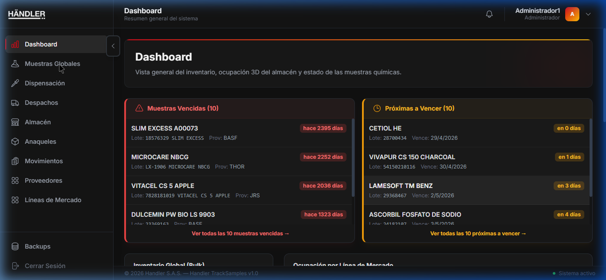
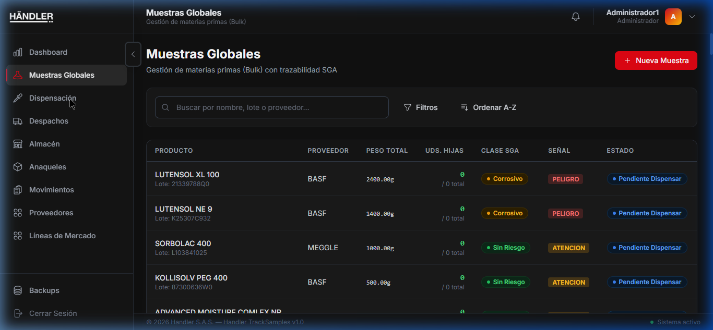
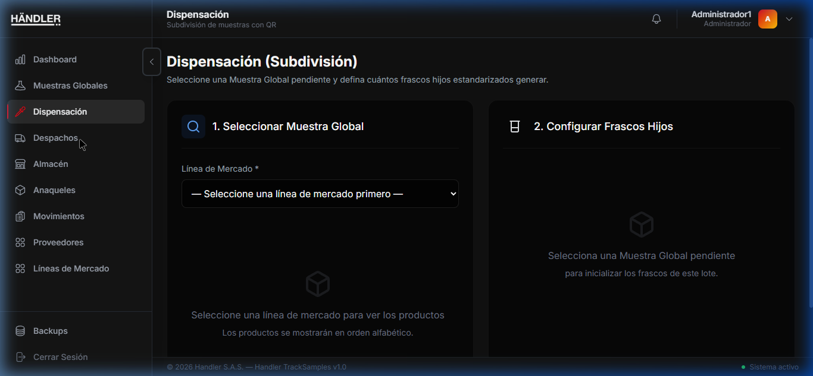
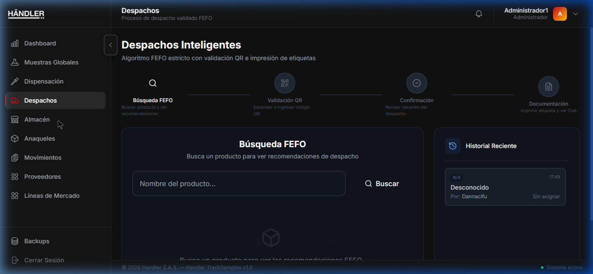
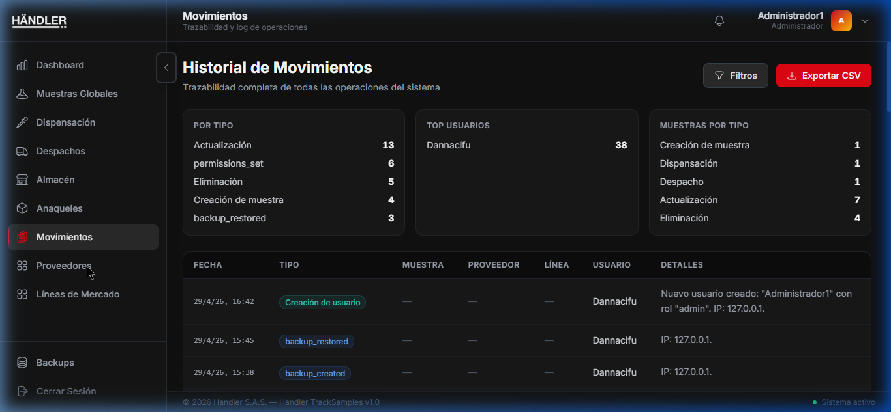
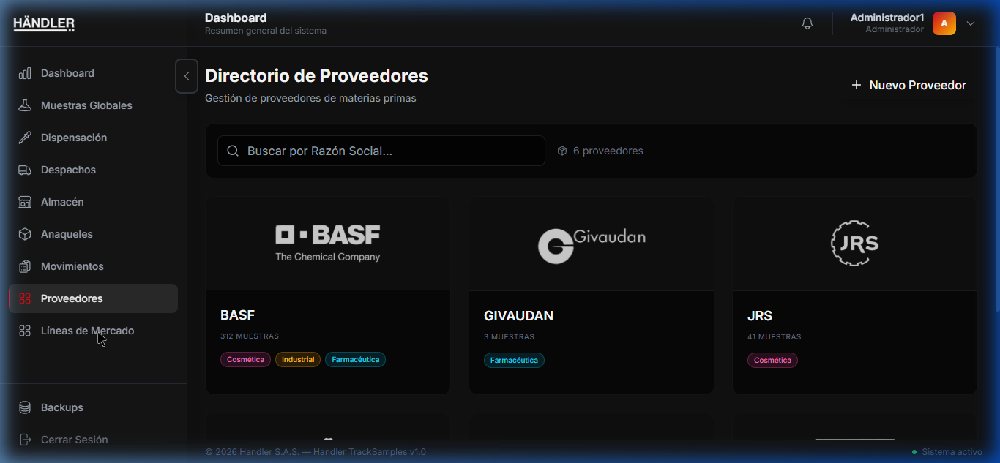
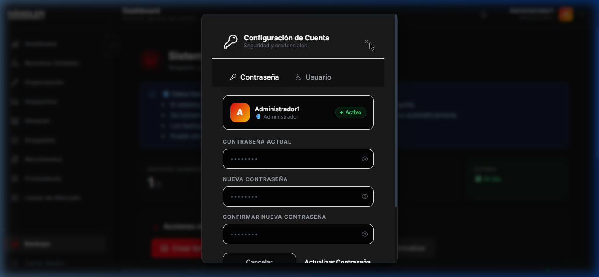

# FACULTAD DE INGENIERÍA DE SISTEMAS
## Unidad para el Desarrollo de la Ciencia, la Investigación y la Innovación — UDCII

---

&nbsp;

&nbsp;

# MANUAL OPERATIVO Y DE USUARIO
# Handler TrackSamples

&nbsp;

**Sistema Integral de Gestión de Inventario de Muestras Químicas**
**con Trazabilidad SGA y Visualización Tridimensional**

&nbsp;

---

| Campo | Detalle |
|---|---|
| **Código del Documento** | FIS – UDCII – G06 |
| **Tipo de Documento** | Manual Operativo / Manual de Usuario |
| **Nombre del Sistema** | Handler TrackSamples |
| **Versión del Software** | v1.0.0 |
| **Versión del Documento** | 1.0 |
| **Fecha de Elaboración** | Mayo de 2026 |
| **Audiencia Objetivo** | Operadores de Almacén, Coordinadores y Administradores |
| **Estado** | Versión Final — Entrega de Grado |

---

| Rol | Nombre |
|---|---|
| **Elaborado por** | Equipo de Desarrollo — Handler S.A.S. |
| **Revisado por** | Director del Proyecto de Grado |
| **Presentado a** | Facultad de Ingeniería de Sistemas — UDCII |

---

&nbsp;

> *Este documento ha sido elaborado como entregable formal del proyecto de grado. Está redactado en lenguaje claro y accesible para el personal operativo y administrativo que interactúa con el sistema Handler TrackSamples en su labor cotidiana. Debe ser leído en su totalidad antes de iniciar el uso del sistema.*

&nbsp;

---

&nbsp;

## CONTROL DE VERSIONES DEL DOCUMENTO

| Versión | Fecha | Descripción del Cambio | Responsable |
|---|---|---|---|
| 0.1 | Abril 2026 | Borrador inicial — recorrido QA de la interfaz | Equipo de Desarrollo |
| 0.5 | Abril 2026 | Documentación de módulos con capturas reales | Equipo de Desarrollo |
| 1.0 | Mayo 2026 | Versión final para entrega de grado | Equipo de Desarrollo |

&nbsp;

---

&nbsp;

## DECLARACIÓN DE CONFIDENCIALIDAD

El presente manual contiene capturas de pantalla, flujos operativos y configuraciones del sistema **Handler TrackSamples**, desarrollado como proyecto de grado en la Facultad de Ingeniería de Sistemas. La información aquí contenida es de uso exclusivo del personal autorizado de la institución y del equipo evaluador del proyecto. Queda prohibida su distribución, reproducción o divulgación a terceros sin autorización expresa del equipo de desarrollo y del director del proyecto de grado.

&nbsp;

---

&nbsp;
# MANUAL OPERATIVO Y DE USUARIO
# Handler TrackSamples v1.0.0

---

**Documento:** FIS – UDCII – G06  
**Tipo:** Manual Operativo / Manual de Usuario  
**Versión del Software:** 1.0.0  
**Fecha de Elaboración:** Mayo de 2026  
**Elaborado por:** Equipo de Desarrollo — Handler S.A.S.  
**Presentado a:** Unidad para el Desarrollo de la Ciencia, la Investigación y la Innovación (UDCII)

---

## TABLA DE CONTENIDO

1. [Cómo navegar por esta guía](./01_Navegacion_Guia.md)
2. [Objetivos de la aplicación](./02_Objetivos_Aplicacion.md)
3. [Requisitos de hardware y software](./03_Requisitos.md)
4. [Instalación, ejecución, reinicio y desinstalación](./04_Instalacion_y_Ejecucion.md)
5. [Presentación y manejo de los módulos del sistema](./05_Modulos_del_Sistema.md)
   - 5.1 Inicio de Sesión (Login)
   - 5.2 Panel de Control (Dashboard)
   - 5.3 Inventario de Muestras Globales
   - 5.4 Dispensación de Muestras
   - 5.5 Despachos (Algoritmo FEFO)
   - 5.6 Almacén 3D
   - 5.7 Gestión de Anaqueles
   - 5.8 Historial de Movimientos
   - 5.9 Directorio de Proveedores
   - 5.10 Líneas de Mercado
   - 5.11 Sistema de Backups
   - 5.12 Gestión de Usuarios y Configuración
6. [Solución de problemas comunes](./06_Solucion_Problemas.md)
7. [Glosario de términos](./07_Glosario.md)

---

# 1. CÓMO NAVEGAR POR ESTA GUÍA DE USUARIO

## 1.1. Propósito de este Manual

El presente **Manual Operativo y de Usuario** ha sido elaborado como documento guía de referencia para el personal que interactúa cotidianamente con la plataforma **Handler TrackSamples** en sus labores de almacenamiento, control y despacho de muestras químicas. El documento está redactado en un lenguaje accesible y orientado a la práctica, sin presuponer conocimientos técnicos avanzados en sistemas informáticos por parte del lector.

Este manual forma parte de los entregables formales del proyecto de grado desarrollado para la Unidad para el Desarrollo de la Ciencia, la Investigación y la Innovación (UDCII), y debe ser leído y comprendido por todo el personal que tenga acceso autorizado al sistema antes de iniciar su operación.

## 1.2. Estructura del Manual y Guía de Uso

El documento está organizado de forma progresiva y modular. Se recomienda la siguiente estrategia de lectura según el perfil del usuario:

| Perfil del Lector | Secciones Prioritarias |
|---|---|
| **Usuario nuevo** que acaba de recibir acceso | Leer en orden: Secciones 1 → 2 → 3 → 4 → 5 completa |
| **Operador experimentado** que busca una función específica | Ir directamente al índice del **Capítulo 5** (Módulos del Sistema) |
| **Administrador** que va a instalar el sistema por primera vez | Leer Secciones 3 y 4 en detalle antes de proceder |
| **Cualquier usuario con un problema** | Consultar directamente la **Sección 6** (Solución de Problemas) |
| **Usuario con duda sobre terminología** | Consultar el **Capítulo 7** (Glosario) al final del documento |

## 1.3. Iconografía y Convenciones Utilizadas

A lo largo de este manual se utilizan las siguientes marcas visuales para resaltar información importante:

> 📌 **Nota:** Información complementaria útil para el usuario.

> ⚠️ **Atención:** Acción que requiere especial cuidado para evitar errores.

> 🔒 **Solo Administrador:** Funcionalidad restringida al perfil de Administrador del sistema.

> ✅ **Paso a Paso:** Procedimiento secuencial que debe seguirse en el orden indicado.

Las imágenes que acompañan cada módulo son capturas de pantalla reales del sistema en funcionamiento, tomadas durante las pruebas de calidad (QA) del software, y corresponden exactamente a la apariencia visual que el usuario verá en su pantalla al operar la aplicación.

---

# 2. OBJETIVOS DE LA APLICACIÓN

## 2.1. Contexto del Sistema

**Handler TrackSamples** es un sistema de información de escritorio desarrollado a la medida para solucionar una problemática concreta: la gestión manual, fragmentada e insegura del inventario de materias primas químicas en un almacén industrial. Antes de la existencia de este sistema, los procesos de registro, consulta y control de muestras dependían de hojas de cálculo o registros físicos, con el riesgo de errores humanos, pérdida de información y violaciones involuntarias a las normas internacionales de seguridad química.

El sistema opera **completamente en el computador del usuario**, sin enviar datos a servidores externos. Toda la información de la empresa queda resguardada de forma local y segura.

## 2.2. Objetivos Específicos del Software

La plataforma fue diseñada con los siguientes propósitos institucionales:

### Objetivo 1 — Control Total del Inventario
Proporcionar una plataforma digital centralizada para registrar con exactitud el ingreso de materias primas (muestras globales), documentando sus fechas de fabricación y vencimiento, peso, proveedor, número de lote, y la ubicación física precisa dentro del almacén (fila, columna y nivel del anaquel).

### Objetivo 2 — Cumplimiento Normativo SGA (Sistema Globalmente Armonizado)
Automatizar el cumplimiento de la norma internacional GHS/SGA de clasificación de productos peligrosos. El sistema almacena los pictogramas de peligro de cada sustancia (flamable, corrosivo, tóxico, etc.) y **bloquea activamente** el almacenamiento de sustancias químicamente incompatibles en el mismo espacio físico, protegiendo al personal y a las instalaciones.

### Objetivo 3 — Reducción de Pérdidas por Vencimiento (FEFO)
Implementar de manera sistemática la metodología **First-Expired-First-Out** (Primero en Vencer, Primero en Salir). El sistema determina automáticamente qué frasco debe ser entregado primero al momento de un despacho, eliminando el criterio subjetivo del operario y reduciendo el desperdicio de material costoso.

### Objetivo 4 — Trazabilidad Completa e Inmutable
Mantener un registro histórico permanente e inalterable de cada operación ejecutada en el sistema: quién lo hizo, qué hizo, sobre qué producto y en qué momento exacto. Este historial es fundamental para auditorías de calidad, certificaciones ISO y la reconstrucción de incidentes operativos.

### Objetivo 5 — Subdivisión Controlada (Dispensación)
Gestionar el proceso de fraccionamiento de materias primas desde grandes recipientes (cuñetes, tambores) hacia frascos más pequeños de uso o entrega final, generando automáticamente un código QR único para cada frasco hijo, que puede ser impreso y pegado físicamente en el recipiente para su identificación rápida con un escáner.

### Objetivo 6 — Visualización Espacial del Almacén (3D)
Ofrecer una representación tridimensional interactiva de la planta de almacenamiento, permitiendo al operario identificar visualmente la ubicación exacta de cualquier producto sin necesidad de desplazarse físicamente por la bodega para su búsqueda.

### Objetivo 7 — Protección de la Información (Backups)
Garantizar la continuidad del negocio frente a fallos de hardware o corrupción de datos, mediante un sistema automatizado de copias de seguridad que preserva toda la información de la empresa de forma local y segura.

---

# 3. REQUISITOS DE HARDWARE Y SOFTWARE

## 3.1. Sistema Operativo Compatible

**Handler TrackSamples** está diseñado, desarrollado y soportado **exclusivamente** para los sistemas operativos **Microsoft Windows 10** y **Microsoft Windows 11**, en su versión de 64 bits. No existe versión para macOS, Linux, tablets, teléfonos celulares ni versiones anteriores de Windows (7, 8, XP).

El software puede utilizarse de dos maneras:
1. **Como aplicación de escritorio nativa:** Haciendo doble clic en el ícono de acceso directo del escritorio. Esta es la forma de uso recomendada y principal.
2. **Desde un navegador web:** Accediendo a `http://localhost:3001` en los navegadores **Google Chrome** o **Microsoft Edge** instalados en la misma máquina donde se instaló el sistema.

> ⚠️ **Atención:** Intentar acceder desde otro computador de la red o desde un celular puede funcionar de manera limitada, pero no está oficialmente soportado ni es el uso esperado del sistema.

## 3.2. Requisitos Mínimos de Hardware

El sistema requiere un mínimo de recursos del computador debido a que ejecuta tres componentes simultáneamente en segundo plano: la base de datos local PostgreSQL, el servidor de la aplicación, y la interfaz gráfica con vista tridimensional del almacén (motor WebGL).

| Componente | Especificación Mínima Requerida |
|---|---|
| **Procesador** | Intel Core i3 (8.ª generación o más reciente) o AMD Ryzen 3. De 64 bits. |
| **Memoria RAM** | 6 GB como mínimo absoluto. Con menos de 6 GB el sistema presentará lentitud severa. |
| **Disco Duro / Almacenamiento** | Al menos 10 GB de espacio libre disponible. Se recomienda un SSD (Disco de Estado Sólido). |
| **Tarjeta de Video** | Compatible con WebGL (cualquier tarjeta integrada Intel UHD o posterior). Los controladores deben estar actualizados. |
| **Pantalla** | Resolución mínima de 1366 × 768 píxeles. |

## 3.3. Requisitos Recomendados para Mejor Desempeño

Si el computador cumple las siguientes especificaciones, el sistema funcionará de manera óptima, especialmente en el módulo de visualización tridimensional del almacén:

| Componente | Especificación Recomendada |
|---|---|
| **Procesador** | Intel Core i5 (10.ª generación o más reciente) o AMD Ryzen 5 |
| **Memoria RAM** | 12 GB DDR4 |
| **Disco Duro / Almacenamiento** | SSD NVMe de alta velocidad |
| **Tarjeta de Video** | GPU dedicada NVIDIA o AMD con soporte WebGL 2.0 |
| **Pantalla** | Resolución Full HD: 1920 × 1080 píxeles |

## 3.4. Software Previo Necesario

Handler TrackSamples es un sistema **autocontenido**. El instalador incluye y gestiona automáticamente todo el software necesario para su funcionamiento. **No se requiere instalar ningún componente manualmente** previo a la instalación.

> 📌 **Nota:** El instalador verificará automáticamente si PostgreSQL (la base de datos) está instalado en el equipo. Si no lo encuentra, lo descargará e instalará durante el proceso de instalación. Todo esto ocurre de forma transparente para el usuario.

---

# 4. INSTALACIÓN, EJECUCIÓN, REINICIO Y DESINSTALACIÓN

## 4.1. Instalación del Sistema

El sistema **Handler TrackSamples** se instala en su computador con Windows 10 o Windows 11 mediante un único archivo de instalación ejecutable. Este proceso fue diseñado para ser lo más sencillo posible y no requiere conocimientos técnicos avanzados, ni instalar programas adicionales.

> ⚠️ **Atención:** El instalador es **autocontenido** — no requiere Docker, ni WSL2, ni ningún otro software previo. Durante la instalación, el sistema verificará e instalará automáticamente PostgreSQL (la base de datos) si no está presente.

### ✅ Paso a Paso para la Instalación

**Paso 1 — Obtener el instalador:**
Solicite al administrador de sistemas o al área de TI el archivo `Handler_TrackSamples_Setup.exe`. Guárdelo en un lugar de fácil acceso (por ejemplo, el escritorio o la carpeta de Descargas).

**Paso 2 — Ejecutar el instalador:**
Haga doble clic sobre el archivo `Handler_TrackSamples_Setup.exe`. Windows puede mostrar una ventana de aviso de seguridad preguntando si desea permitir que la aplicación realice cambios en el equipo. Haga clic en **"Sí"** para continuar.

**Paso 3 — Seguir el asistente de instalación:**
El programa mostrará una serie de pantallas guiadas. En cada una, revise la información y haga clic en **"Siguiente"** o **"Instalar"**. Las opciones más importantes son:
- **Directorio de instalación:** Por defecto es `C:\Program Files\Handler TrackSamples\`. Se recomienda no cambiar esta ubicación.
- **Acceso directo en el escritorio:** Asegúrese de que esta casilla esté marcada. Así tendrá el ícono de Handler TrackSamples directamente en su escritorio.

**Paso 4 — Esperar la instalación automática:**
Durante este paso, el instalador realiza de forma automática y transparente varias acciones en segundo plano:
- Verifica si PostgreSQL (la base de datos) está instalado. Si no lo encuentra, lo descarga e instala automáticamente.
- Configura la base de datos y crea los servicios necesarios para que el sistema funcione correctamente.
- Prepara los datos iniciales del sistema (proveedores, anaqueles, líneas de mercado).

Este proceso puede tardar entre **2 y 5 minutos** dependiendo de la velocidad del computador y de la descarga.

**Paso 5 — Finalizar:**
Cuando aparezca la pantalla de "Instalación completada", haga clic en "Finalizar". Si la casilla "Iniciar Handler TrackSamples ahora" está marcada, la aplicación se abrirá automáticamente.

### ✅ Primer Arranque — Asistente de Configuración

La **primera vez** que abra la aplicación después de instalar, el sistema lo guiará a través de un asistente de configuración (Setup Web Wizard) en su navegador. Este asistente le pedirá:

1. **Datos de conexión a la base de datos:** Normalmente no necesita cambiar nada aquí, los valores vienen precargados.
2. **Creación del usuario Administrador:** Ingrese un nombre de usuario y una contraseña segura para el administrador del sistema.
3. **Finalización:** El sistema verificará la conexión y completará la configuración.

Una vez completado este asistente, la aplicación estará lista para usarse.

---

## 4.2. Cómo Abrir (Ejecutar) el Sistema

Una vez instalado y configurado, para abrir la aplicación en cualquier momento:

1. Busque el ícono de **"Handler TrackSamples"** en su escritorio de Windows.
2. Haga **doble clic** sobre él.
3. La ventana principal de la aplicación se abrirá mostrando la pantalla de inicio de sesión.

> 📌 **Nota:** El sistema se inicia automáticamente con Windows. No es necesario realizar ninguna verificación previa antes de abrir la aplicación.

**Credenciales de acceso:**
- Las credenciales de usuario (nombre de usuario y contraseña) son asignadas por el Administrador del sistema. Si es su primera vez usando el sistema, use las credenciales que creó durante el asistente de configuración inicial, o contacte al administrador de TI.

---

## 4.3. Cómo Reiniciar el Sistema

Si la aplicación se congela, responde muy lentamente, o la vista del Almacén 3D deja de funcionar correctamente, siga este procedimiento de reinicio:

### ✅ Reinicio Normal

1. Haga clic en la **"X"** roja en la esquina superior derecha de la ventana de Handler TrackSamples para cerrar la aplicación.
2. Espere 5 segundos para que todos los procesos internos terminen correctamente.
3. Haga doble clic nuevamente en el ícono del escritorio para abrir la aplicación.

### ✅ Reinicio de los Servicios de Fondo (si el problema persiste)

Si después del reinicio normal el sistema sigue sin responder correctamente, solicite al área de TI que reinicie los servicios del sistema:

1. El área de TI debe reiniciar el servicio "HandlerTrackSamples" desde la herramienta de servicios de Windows.
2. Espere 15 segundos y vuelva a abrir la aplicación.

### Reinicio Forzado (si la aplicación no responde)

Si la ventana está completamente bloqueada y no responde al clic en la "X":
1. Presione las teclas `Ctrl + Alt + Supr` en su teclado.
2. Seleccione **"Administrador de tareas"**.
3. Busque "Handler TrackSamples" en la lista de procesos, haga clic derecho y seleccione **"Finalizar tarea"**.
4. Espere 10 segundos y vuelva a abrir la aplicación desde el escritorio.

---

## 4.4. Cómo Desinstalar el Sistema

> ⚠️ **Atención Importante:** Antes de desinstalar el sistema, asegúrese de haber realizado un backup de toda la información. Una desinstalación eliminará la aplicación, pero **los datos persistentes (base de datos, archivos subidos, backups) NO se eliminan automáticamente**. Si desea una limpieza completa, debe informar al área de TI.

### ✅ Paso a Paso para Desinstalar

**Opción A — Desde la Configuración de Windows:**
1. Abra el menú de **Inicio de Windows**.
2. Vaya a `Configuración (ícono de engranaje) → Aplicaciones → Aplicaciones y características`.
3. En el cuadro de búsqueda, escriba "Handler TrackSamples".
4. Haga clic sobre el resultado y luego en el botón **"Desinstalar"**.
5. Confirme la acción cuando Windows lo solicite.

**Opción B — Desde el directorio de instalación:**
1. Navegue a `C:\Program Files\Handler TrackSamples\` en el Explorador de archivos.
2. Haga doble clic en el archivo `uninstall.exe`.
3. Siga las instrucciones del asistente.

### ¿Qué se elimina y qué se conserva?

| Se elimina | Se conserva |
|---|---|
| Archivos del programa en `C:\Program Files\Handler TrackSamples\` | Base de datos PostgreSQL (los datos del inventario) |
| Acceso directo del escritorio y menú Inicio | Archivos subidos (Certificados de Análisis PDF) |
| Servicio de Windows "HandlerTrackSamples" | Backups exportados en `C:\ProgramData\HandlerTrackSamples\backups\` |
| Regla del Firewall de Windows | Logs del sistema |

> 📌 **Nota:** Si necesita eliminar también los datos persistentes, contacte al área de TI para que realice la limpieza manual del directorio `C:\ProgramData\HandlerTrackSamples\`. **Esta acción es irreversible: una vez eliminados los datos, no podrá recuperarlos a menos que tenga un backup externo.**

---

# 5. PRESENTACIÓN Y MANEJO DE LOS MÓDULOS DEL SISTEMA

Esta sección constituye el núcleo principal del manual de usuario. A continuación, se documenta de forma detallada cada módulo funcional del sistema, acompañado de su respectiva captura de pantalla real y una descripción paso a paso de las operaciones que puede realizar en él.

---

## 5.1. Inicio de Sesión (Login)

### ¿Qué es esta pantalla?
Es la puerta de entrada al sistema. **Handler TrackSamples** utiliza un sistema de acceso con usuario y contraseña para garantizar que sólo el personal autorizado pueda ver y gestionar la información del inventario. Cada usuario tiene sus propias credenciales y un perfil de permisos asignado por el Administrador.

### ¿Cómo acceder al sistema?

✅ **Paso a Paso:**
1. Ingrese su **nombre de usuario** en el primer campo de texto. Este fue proporcionado por el Administrador del sistema al momento de crear su cuenta.
2. Ingrese su **contraseña** en el segundo campo. La contraseña es sensible a mayúsculas y minúsculas; si tiene activada la tecla "Bloq Mayús", desactívela antes de escribirla.
3. Haga clic en el botón **"Iniciar Sesión"**.
4. Si las credenciales son correctas, el sistema lo llevará automáticamente al Panel de Control (Dashboard). Si son incorrectas, aparecerá un mensaje de error. Verifique sus datos e inténtelo nuevamente.

> 📌 **Nota:** La sesión tiene una duración de 8 horas. Pasado ese tiempo, el sistema le pedirá que inicie sesión nuevamente como medida de seguridad.

> 🔒 **Solo Administrador:** Si olvidó su contraseña, debe contactar al Administrador del sistema. Él tiene la capacidad de restablecer credenciales desde el módulo de Gestión de Usuarios.

---

## 5.2. Panel de Control (Dashboard)

### ¿Qué es esta pantalla?
Es la primera pantalla que ve después de iniciar sesión. Funciona como un **centro de control y alerta temprana** del almacén. Su objetivo es mostrarle de un vistazo el estado actual del inventario, priorizando la información más urgente: los productos que ya vencieron y los que están próximos a vencer.

### ¿Qué información encuentra aquí?

- **Tarjeta "Muestras Vencidas" (color rojo):** Muestra el número total de materias primas cuya fecha de vencimiento ya pasó. Estos productos no deben ser despachados ni utilizados. Haga clic en esta tarjeta para ir directamente a la lista de productos vencidos y tomar acción.
- **Tarjeta "Próximas a Vencer" (color amarillo):** Muestra los productos que vencerán en los próximos 30 días. Estos requieren atención prioritaria para ser utilizados o despachados antes de expirar.
- **Menú lateral izquierdo:** Es la barra de navegación principal del sistema. Desde aquí puede acceder a todos los módulos autorizados para su perfil de usuario.

> 📌 **Buena Práctica:** Se recomienda revisar el Dashboard cada vez que inicie su jornada laboral, antes de comenzar cualquier operación de inventario.

---

## 5.3. Inventario de Muestras Globales

### ¿Qué es este módulo?
Es el registro central del almacén. Aquí se encuentra el listado de todas las **materias primas en su presentación original** (recipientes grandes, cuñetes, tambores) que han sido ingresadas al sistema. Cada fila de la tabla representa un lote específico de un producto químico, con toda su información normativa y de ubicación.

### ¿Qué información muestra la tabla?
Cada muestra registrada muestra: nombre del producto, proveedor, número de lote, fecha de fabricación, fecha de vencimiento, línea de mercado a la que pertenece, unidades disponibles, peso total en gramos, clase de peligrosidad según la norma SGA (con su color identificador), y la posición física donde está guardada en el anaquel.

### ¿Cómo registrar una nueva materia prima que llegó al almacén?

✅ **Paso a Paso:**
1. Haga clic en el botón **"Nueva Muestra"** (generalmente en la esquina superior derecha de la pantalla).
2. Complete el formulario con todos los datos del producto:
   - **Nombre:** Nombre técnico o comercial de la materia prima.
   - **Proveedor:** Seleccione de la lista el proveedor que la suministró (BASF, JRS, THOR, JRF, SUDEEP, GIVAUDAN, MEGGLE, u otro registrado).
   - **Lote:** Número de lote del recipiente, tal como aparece en la etiqueta física.
   - **Fecha de Fabricación y Vencimiento:** Ingrese las fechas exactas según el certificado del proveedor. La fecha de fabricación no puede ser posterior a la de vencimiento.
   - **Línea de Mercado:** Seleccione la categoría comercial correspondiente (Cosmética, Farmacéutica, Industrial).
   - **Clase de Peligro SGA:** Seleccione la clasificación correcta (Sin Riesgo, Inflamable, Corrosivo, Tóxico, Comburente, Explosivo). Esta información está en la ficha de datos de seguridad (FDS) del producto.
   - **Pictogramas GHS:** Marque todos los pictogramas de advertencia que aparecen en el envase del producto.
   - **Peso total (gramos):** Peso total del recipiente en gramos.
   - **Unidades:** Número de recipientes de este lote que ingresaron.
   - **CoA (Certificado de Análisis):** Si tiene el documento PDF del certificado de análisis, puede adjuntarlo aquí para que quede vinculado al registro.
3. Haga clic en **"Guardar"** o **"Crear Muestra"**.
4. El sistema verificará que los datos son correctos y, si todo está bien, la nueva muestra aparecerá en la tabla del inventario.

### ¿Cómo buscar un producto específico?
Utilice la **barra de búsqueda** en la parte superior de la tabla. Puede buscar por nombre del producto, número de lote o proveedor. Los resultados se filtran en tiempo real mientras escribe.

> ⚠️ **Atención SGA:** Si el sistema muestra un mensaje de advertencia al guardar, es porque detectó que el producto que intenta almacenar en una ubicación específica del anaquel es **químicamente incompatible** con otro producto ya almacenado allí. En ese caso, asigne el producto a un anaquel diferente, alejado de los productos con los que es incompatible.

---

## 5.4. Dispensación de Muestras

### ¿Qué es este módulo?
La **Dispensación** es el proceso de tomar un recipiente grande (la muestra global, como un cuñete de 25 kg) y dividirlo en **varios frascos más pequeños** que serán entregados a los departamentos de producción, clientes o laboratorios. Cada frasco pequeño generado recibe automáticamente un **código QR único** que puede imprimirse y pegarse en el recipiente físico para su identificación.

### ¿Cómo realizar una dispensación?

✅ **Paso a Paso:**
1. En el menú lateral, haga clic en **"Dispensación"**.
2. **Seleccione la Línea de Mercado** del producto que desea dispensar (Cosmética, Farmacéutica o Industrial). Esto filtra el inventario para mostrar sólo los productos de esa categoría.
3. En la lista de productos, identifique la muestra global de la que tomará el material y haga clic en ella.
4. En el panel **"Configurar Frascos Hijos"**:
   - **Número de frascos:** Cuántos recipientes pequeños va a llenar.
   - **Peso por frasco (gramos):** Cuántos gramos contendrá cada frasco pequeño.
5. El sistema calculará automáticamente si el peso total de los frascos hijos es compatible con el peso disponible en la muestra global. Si no hay suficiente material, mostrará un error.
6. Haga clic en **"Ejecutar Dispensación"**.
7. El sistema registrará los nuevos frascos, descontará el peso del recipiente original y generará los códigos QR para cada frasco hijo.
8. Imprima los códigos QR y péguelos en los recipientes físicos correspondientes.

> 📌 **Nota:** Cada frasco hijo hereda automáticamente toda la información del producto padre: lote, fecha de vencimiento, datos del proveedor y certificado de análisis. No es necesario ingresar esta información nuevamente.

---

## 5.5. Despachos (Algoritmo FEFO)

### ¿Qué es este módulo?
El módulo de **Despachos** gestiona la salida de productos del almacén cuando alguien los solicita (un departamento de producción, un cliente, un laboratorio). Su característica más importante es que implementa el criterio **FEFO** (del inglés *First-Expired, First-Out*: "Primero en Vencer, Primero en Salir"), lo que significa que el sistema le indica automáticamente **cuál frasco específico debe entregar primero**, sin dejarle esa decisión al criterio del operario.

Esto evita el error muy común de despachar frascos "al azar" mientras otros con fecha de vencimiento más próxima quedan en el fondo del estante y terminan venciéndose sin usarse.

### ¿Cómo realizar un despacho?

✅ **Paso a Paso:**
1. En el menú lateral, haga clic en **"Despachos"**.
2. En el campo de búsqueda, escriba el **nombre del producto** que le están solicitando.
3. Haga clic en el botón **"Buscar"**.
4. El sistema mostrará una lista de todos los frascos disponibles de ese producto, ordenados por urgencia de vencimiento. El frasco que aparece primero (resaltado) es **el que DEBE entregar primero** según la norma FEFO.
5. La tarjeta del frasco recomendado muestra:
   - Su **código QR** (para localizarlo físicamente en el estante).
   - La **ubicación exacta** en el almacén: nombre del anaquel, columna (X), nivel (Y) y profundidad (Z).
   - Los **días restantes** de vida útil.
6. Retire físicamente ese frasco del estante según las coordenadas indicadas.
7. Haga clic en **"Confirmar Despacho"** para registrar la salida en el sistema.

> ⚠️ **Atención:** Una vez confirmado el despacho, el sistema registra la salida de ese frasco y actualiza el inventario. Esta acción no puede deshacerse fácilmente. Asegúrese de haber retirado el frasco correcto antes de confirmar.

---

## 5.6. Almacén — Visualización Tridimensional

### ¿Qué es este módulo?
Es el **mapa interactivo en tres dimensiones** de su bodega de almacenamiento. Permite ver de forma visual e intuitiva cómo están distribuidos los anaqueles, qué tan llenos están y dónde está ubicado cada producto, sin necesidad de caminar físicamente por el almacén.

### ¿Cómo navegar en el mapa 3D?
- **Rotar la vista:** Mantenga presionado el botón izquierdo del ratón y mueva el ratón en cualquier dirección para girar la cámara alrededor del almacén.
- **Hacer zoom:** Use la rueda de desplazamiento del ratón (scroll) para acercarse o alejarse.
- **Desplazarse lateralmente:** Mantenga presionado el botón derecho del ratón y mueva el ratón.
- **Hacer clic en una celda ocupada:** Si hace clic en un bloque de color dentro del anaquel, aparecerá un panel lateral con la información del producto almacenado en esa posición (nombre, lote, vencimiento, proveedor).

### ¿Qué significan los colores?
- **Verde:** El frasco está almacenado correctamente y su fecha de vencimiento está lejana.
- **Amarillo/Naranja:** El frasco está próximo a vencer (menos de 30 días).
- **Rojo:** El frasco ya está vencido.
- **Gris (celda vacía):** Espacio disponible en el anaquel.

---

## 5.7. Gestión de Anaqueles

### ¿Qué es este módulo?
Permite **registrar y configurar los muebles de almacenamiento físico** (estanterías, racks, anaqueles) que existen en la bodega. Cada anaquel registrado aquí aparece luego en el mapa 3D del almacén. El sistema viene preconfigurado con 14 anaqueles físicos distribuidos en las 3 líneas de mercado.

### ¿Cómo ver el estado de un anaquel?
Cada tarjeta de anaquel muestra su nombre, la línea de mercado a la que pertenece, sus dimensiones en la cuadrícula 3D (columnas × niveles × profundidad) y el **porcentaje de ocupación** actual calculado automáticamente por el sistema.

### ¿Cómo crear un nuevo anaquel?

> 🔒 **Solo Administrador:** Esta acción requiere el permiso `warehouse.create_shelf`.

✅ **Paso a Paso:**
1. Haga clic en el botón **"Nuevo Anaquel"**.
2. Complete el formulario:
   - **Nombre:** Nombre identificador del anaquel (Ej: "BASF #4", "MIXTO #2").
   - **Línea de Mercado:** A qué categoría pertenece este mueble.
   - **Tipo:** "Almacenamiento normal" o "Zona temporal para muestras bulk".
   - **Dimensiones:** Número de columnas (ancho), niveles (alto) y profundidad. Estos valores definen el tamaño de la cuadrícula 3D del anaquel.
3. Haga clic en **"Guardar"**. El nuevo anaquel aparecerá en el mapa 3D.

---

## 5.8. Historial de Movimientos

### ¿Qué es este módulo?
Es el **libro de registro inmutable** del sistema. Aquí queda guardado un historial detallado y permanente de cada acción realizada en el sistema por cualquier usuario: quién inició sesión, quién ingresó una muestra nueva, quién hizo un despacho, quién realizó cambios en la configuración, y cuándo ocurrió cada acción.

Este registro **no puede ser editado ni eliminado** por ningún usuario, ni siquiera el Administrador, lo que lo convierte en una herramienta confiable para auditorías de calidad y control interno.

### ¿Cómo usar el historial?
- La tabla muestra los eventos en orden cronológico descendente (el más reciente primero).
- Cada fila muestra: fecha y hora exacta, tipo de acción, nombre del usuario que la realizó, y el producto afectado (si aplica).
- Puede usar los **filtros** para buscar eventos por tipo de acción, usuario o rango de fechas.

### ¿Cómo exportar el historial?
1. Aplique los filtros que desee (o déjelos en blanco para exportar todo).
2. Haga clic en el botón **"Exportar CSV"**.
3. Se descargará un archivo `.csv` que puede abrir en Microsoft Excel para análisis o presentación a entes de control.

---

## 5.9. Directorio de Proveedores

### ¿Qué es este módulo?
Es la agenda de contactos de los **proveedores de materias primas** con los que trabaja la empresa. El sistema viene preconfigurado con los 7 proveedores reales de la operación: **BASF, JRS, THOR, JRF, SUDEEP, GIVAUDAN y MEGGLE**. Cada proveedor está vinculado a las líneas de mercado que abastece.

### ¿Cómo agregar un nuevo proveedor?

> 🔒 **Solo Administrador:** Requiere permiso `suppliers.create`.

1. Haga clic en el botón **"Nuevo Proveedor"**.
2. Complete el formulario con el nombre, teléfono, correo electrónico, dirección y las líneas de mercado que abastece.
3. Opcionalmente, puede subir el **logotipo** del proveedor en formato imagen (PNG o JPG) para que aparezca en su tarjeta de presentación dentro del sistema.
4. Haga clic en **"Guardar"**.

---

## 5.10. Líneas de Mercado

### ¿Qué es este módulo?
Las Líneas de Mercado son las **categorías principales** que organizan todo el inventario del almacén. El sistema viene preconfigurado con tres: **Cosmética, Farmacéutica e Industrial**. Cada anaquel y cada muestra química pertenecen a una línea de mercado.

### ¿Cómo crear una nueva línea de mercado?

> 🔒 **Solo Administrador:** Requiere permiso `market_lines.create`.

1. Haga clic en **"Nueva Línea"**.
2. Ingrese el nombre de la nueva categoría de negocio.
3. Haga clic en **"Guardar"**.

> ⚠️ **Atención:** Eliminar una línea de mercado que tenga anaqueles y muestras asociadas **eliminará en cascada todos esos datos**. Solo realice esta acción si está completamente seguro.

---

## 5.11. Sistema de Copias de Seguridad (Backups)

### ¿Qué es este módulo?

> 🔒 **Solo Administrador:** Este módulo sólo es visible y accesible para usuarios con rol de Administrador.

Es el **sistema de respaldo y recuperación** de toda la información del sistema. Permite crear copias de seguridad de la base de datos local (inventario completo, movimientos, usuarios, configuración de anaqueles) y, en caso de emergencia o pérdida de datos, restaurar el sistema a un punto anterior.

Las copias de seguridad se guardan directamente dentro de la base de datos local del sistema, en la misma infraestructura del software instalado en su computador Windows, sin enviar ningún dato a internet ni a servidores externos.

### ¿Cómo crear un backup manual?

✅ **Paso a Paso:**
1. En el menú lateral, haga clic en **"Backups"**.
2. En el panel principal, haga clic en el botón **"Crear Backup Ahora"**.
3. El sistema exportará automáticamente toda la base de datos y guardará la copia con un nombre que incluye la fecha y hora actual (Ej: `backup_handler_2026-05-04T12-00-00.json`).
4. Tras unos segundos, el nuevo backup aparecerá en la lista de backups disponibles con su tamaño en MB.

> 📌 **Nota:** El sistema mantiene un máximo de **3 backups** almacenados. Cuando se crea un cuarto backup, el más antiguo se elimina automáticamente. Se recomienda exportar y guardar en una unidad externa los backups más importantes si desea conservarlos por más tiempo.

> 📌 **Backup Automático:** El sistema también realiza copias de seguridad automáticas cada 20 días a las 12:00 PM. Puede modificar este intervalo desde el mismo panel de Backups.

### ¿Cómo restaurar un backup?

> ⚠️ **Atención Crítica:** Restaurar un backup **reemplaza toda la información actual** de la base de datos con los datos del punto de restauración seleccionado. La información registrada después de ese backup se perderá permanentemente. Cree siempre un backup del estado actual antes de restaurar.

1. En la lista de backups disponibles, identifique el backup al cual desea volver.
2. Haga clic en **"Restaurar"** junto a ese backup.
3. El sistema le pedirá que ingrese su **contraseña de administrador** como confirmación de seguridad.
4. Ingrese la contraseña correcta y confirme la acción.
5. El sistema restaurará la base de datos. Este proceso puede tardar uno o dos minutos.

---

## 5.12. Gestión de Usuarios y Configuración Personal

### Cambio de Contraseña Personal (Todos los usuarios)
Cualquier usuario puede cambiar su propia contraseña de acceso desde el menú de perfil:
1. Haga clic en su nombre de usuario en la esquina superior de la interfaz.
2. Seleccione **"Configuración"** o **"Cambiar contraseña"**.
3. Ingrese su contraseña actual para verificar su identidad.
4. Ingrese la nueva contraseña dos veces para confirmarla.
5. Haga clic en **"Guardar cambios"**.

> 📌 **Recomendación de Seguridad:** Use una contraseña de al menos 8 caracteres que combine letras mayúsculas, minúsculas, números y caracteres especiales. Cámbiela periódicamente.

### Administración de Usuarios

> 🔒 **Solo Administrador:** El módulo `/users` sólo es accesible para el Administrador.

Desde este módulo, el Administrador puede:

**Crear un nuevo usuario:**
1. Haga clic en el botón **"Crear Usuario"**.
2. Ingrese el nombre de usuario, la contraseña inicial y seleccione el rol (`admin`, `operator` o `analyst`).
3. Configure los permisos individuales del usuario mediante los toggles de la lista de permisos.
4. Haga clic en **"Guardar"**.

**Editar permisos de un usuario existente:**
1. Haga clic sobre la tarjeta del usuario que desea modificar.
2. Ajuste los toggles de permisos según las responsabilidades del empleado.
3. Guarde los cambios.

**Eliminar un usuario:**
1. Haga clic en el botón de eliminar junto al usuario (ícono de papelera o cruz).
2. Confirme la acción.

> ⚠️ **Atención:** El Administrador no puede eliminar su propia cuenta de usuario para evitar dejar el sistema sin acceso administrativo.

---

# 6. SOLUCIÓN DE PROBLEMAS COMUNES

Esta sección le ayudará a resolver de forma autónoma los inconvenientes más frecuentes que pueden presentarse durante el uso cotidiano de **Handler TrackSamples**. Si el problema que experimenta no aparece en este listado, contacte al área de soporte de Tecnologías de la Información (TI) de su institución.

---

## 6.1. No puedo iniciar sesión — La aplicación rechaza mi usuario y contraseña

**¿Qué está pasando?**
El sistema no reconoce la combinación de usuario y contraseña ingresada.

**Posibles causas y soluciones:**

| Causa | Solución |
|---|---|
| La tecla **"Bloq Mayús"** está activada en su teclado | Verifique que el indicador de "Bloq Mayús" esté apagado. Presione la tecla "Bloq Mayús" para desactivarla y vuelva a intentarlo. |
| Está escribiendo el nombre de usuario o contraseña con errores tipográficos | Borre los campos completamente y vuelva a escribirlos con cuidado, respetando mayúsculas y minúsculas. |
| Su cuenta fue desactivada o su contraseña fue cambiada por el Administrador | Contacte al Administrador del sistema para que verifique el estado de su cuenta. |
| Olvidó su contraseña | No existe una recuperación automática de contraseña. El Administrador debe restablecer su contraseña desde el módulo de Gestión de Usuarios. |

---

## 6.2. La aplicación muestra un error de conexión o no carga los datos después de abierta

**¿Qué está pasando?**
La ventana de la aplicación se abre correctamente, pero al intentar iniciar sesión o navegar entre módulos, aparece un mensaje de error de red o la pantalla se queda cargando indefinidamente.

**Causa:** El servicio de base de datos local (PostgreSQL) no está activo, o el servicio de la aplicación (HandlerTrackSamples) no se inició correctamente.

**Solución paso a paso:**
1. **Cierre la aplicación** completamente (haga clic en la "X" roja).
2. **Espere 10 segundos** y vuelva a abrir la aplicación desde el escritorio. Los servicios de fondo deberían iniciarse automáticamente.
3. Si el problema persiste, **verifique que los servicios de Windows estén activos:**
   - Presione `Ctrl + Alt + Supr` y seleccione "Administrador de tareas".
   - Vaya a la pestaña "Servicios" o "Servicios".
   - Busque "HandlerTrackSamples" y "postgresql-x64-15". Ambos deben mostrar estado "En ejecución".
4. Si alguno aparece "Detenido", **solicite al área de TI** que reinicie los servicios.
5. Si el problema continúa, reinicie el computador completamente.

---

## 6.3. El sistema me bloqueó y no me deja guardar una muestra en un anaquel específico — Advertencia de "Incompatibilidad Química"

**¿Qué está pasando?**
Al intentar asignar una muestra a una posición específica dentro de un anaquel, el sistema muestra una alerta de incompatibilidad y no permite guardar la operación.

**Causa:** El sistema detectó que la muestra que intenta almacenar tiene una clase de peligro SGA que es incompatible con otro producto ya almacenado en ese mismo anaquel. Por ejemplo, no está permitido almacenar un producto "Inflamable" junto a un producto "Comburente" (oxidante), ya que esta combinación puede generar un riesgo real de incendio o explosión.

**Solución:**
- Esta advertencia es una **medida de protección** y no debe ser ignorada. El sistema está cumpliendo con las normas internacionales de seguridad química (SGA/GHS).
- No almacene el producto en esa ubicación. En cambio, asígnelo a un **anaquel diferente** donde no existan productos con los que sea incompatible.
- Si tiene dudas sobre dónde almacenar el producto de forma segura, consulte la **Ficha de Datos de Seguridad (FDS)** del producto o al responsable de seguridad industrial de su empresa.

---

## 6.4. El mapa del Almacén 3D aparece en negro o no se visualiza correctamente

**¿Qué está pasando?**
Al acceder al módulo de Almacén, el espacio donde debería verse la bodega tridimensional aparece completamente negro, o los objetos se ven distorsionados.

**Causa:** El motor de gráficos 3D (WebGL) perdió su contexto de memoria de video, generalmente por falta temporal de recursos en la tarjeta gráfica del computador.

**Solución:**
1. No se alarme. Esta situación **no afecta los datos** almacenados en el sistema.
2. Haga clic en la **"X"** roja de la ventana de Handler TrackSamples para cerrar la aplicación completamente.
3. Espere 10 segundos.
4. Vuelva a abrir la aplicación desde el ícono del escritorio.
5. Al recargar, el mapa 3D debería visualizarse correctamente.

Si el problema persiste sistemáticamente, informe al área de TI. Puede estar relacionado con controladores (drivers) de la tarjeta de video que necesitan actualización, o con que el computador no cumple con los requisitos mínimos de hardware para el módulo 3D.

---

## 6.5. Cometí un error en el sistema — Registré información incorrecta

**¿Qué está pasando?**
Ingresó datos incorrectos en el sistema (por ejemplo, un peso equivocado, una fecha de vencimiento errónea, o realizó un despacho de un frasco que no debía).

**Qué hacer:**
1. **Mantenga la calma.** El sistema mantiene un registro de todas las operaciones en el Historial de Movimientos. Su error ha quedado documentado y puede ser rastreado.
2. **No intente "arreglar" el error realizando más operaciones** que podrían complicar la situación.
3. Diríjase al módulo de **Inventario de Muestras** y, si tiene los permisos correspondientes, edite el registro con la información correcta. El sistema registrará automáticamente la corrección en el historial.
4. Si el error fue más grave (como un despacho incorrecto que no puede revertirse fácilmente), **notifique inmediatamente al Administrador del sistema**. El Administrador puede restaurar un backup del día anterior si dispone de uno actualizado.

> 📌 **Lección importante:** Este es el motivo principal por el que se recomienda que el Administrador cree backups de forma periódica. Un backup reciente permite restaurar el sistema a un estado anterior y deshacer errores graves.

---

## 6.6. Mi sesión se cerró sola en medio del trabajo

**¿Qué está pasando?**
El sistema lo redirigió a la pantalla de inicio de sesión sin que usted lo haya solicitado.

**Causa:** Las sesiones de usuario tienen una duración máxima de **8 horas** como medida de seguridad. Pasado ese tiempo, el sistema cierra la sesión automáticamente para proteger la información en caso de que el computador quede desatendido.

**Solución:** Inicie sesión nuevamente con sus credenciales. Si estaba en medio de un formulario, es posible que deba ingresar la información nuevamente.

> 📌 **Consejo:** Si trabaja en turnos largos y este problema es recurrente, solicite al Administrador que ajuste la duración de la sesión en la configuración del sistema.

---

## 6.7. El sistema tarda mucho en cargar o responde lentamente

**Posibles causas y soluciones:**

| Causa | Solución |
|---|---|
| El computador tiene poca memoria RAM disponible | Cierre los programas que no esté usando (navegadores con muchas pestañas, reproductores de video, etc.) para liberar memoria. |
| El disco duro está casi lleno | Verifique que tenga al menos 5 GB libres en el disco donde está instalado el sistema. |
| La aplicación lleva mucho tiempo abierta sin reiniciarse | Cierre y vuelva a abrir la aplicación para liberar la memoria acumulada (Reinicio normal del punto 4.3). |
| El servicio de base de datos está consumiendo muchos recursos | Si el problema es recurrente, solicite al área de TI que verifique la configuración de PostgreSQL. |

---

# 7. GLOSARIO DE TÉRMINOS

Este glosario define los términos técnicos, normativos y operativos utilizados a lo largo del presente Manual de Usuario y en la interfaz del sistema **Handler TrackSamples**. Su propósito es estandarizar el lenguaje entre el personal operativo, administrativo y de TI.

---

**Algoritmo FEFO (First-Expired, First-Out)**
Regla logística que ordena que el producto con la fecha de vencimiento más próxima debe ser el primero en salir del almacén. En Handler TrackSamples, este algoritmo está implementado en el módulo de Despachos y determina automáticamente qué frasco debe ser entregado primero, sin depender del criterio subjetivo del operario.

---

**Anaquel**
Representación digital de un mueble físico de almacenamiento (estantería, rack o armario de laboratorio) dentro del sistema. Cada anaquel está definido por sus dimensiones en una cuadrícula tridimensional: número de columnas (ancho), número de niveles (alto) y profundidad. Pertenece a una sola Línea de Mercado.

---

**Backup (Copia de Seguridad)**
Imagen completa del estado de la base de datos en un momento específico del tiempo. Contiene toda la información del inventario: muestras, anaqueles, usuarios, movimientos, proveedores y configuraciones. En Handler TrackSamples, los backups se almacenan localmente en la base de datos del sistema, sin enviar datos a internet. El sistema guarda un máximo de 3 backups simultáneos.

---

**Certificado de Análisis (CoA — Certificate of Analysis)**
Documento oficial emitido por el fabricante o proveedor de una materia prima que certifica los resultados de las pruebas de calidad y pureza realizadas sobre ese lote específico. En el sistema, puede adjuntarse como archivo PDF al registro de cada muestra global.

---

**Clase de Peligro SGA (GHS Hazard Class)**
Categoría de riesgo asignada a una sustancia química según el Sistema Globalmente Armonizado (SGA). Las clases disponibles en el sistema son: Sin Riesgo, Inflamable, Corrosivo, Tóxico, Comburente y Explosivo. Esta clasificación determina las restricciones de almacenamiento y compatibilidad entre productos.

---

**Código QR**
Imagen en forma de cuadrícula de puntos negros y blancos que codifica la información de identificación de un frasco dispensado. Cada frasco hijo generado por el sistema recibe un código QR único que contiene: ID interno, número de lote, nombre del producto, número de submuestra y peso en gramos. Puede imprimirse y pegarse en el recipiente físico para su identificación rápida mediante un escáner o la cámara de un celular.

---

**Despacho**
Proceso de sacar un producto del almacén y registrar su entrega a un solicitante (departamento de producción, cliente, laboratorio). En el sistema, un despacho cambia el estado del frasco dispensado de "Almacenado" a "Despachado" y registra la fecha y hora exacta de la salida.

---

**Dispensación**
Proceso de fraccionar el contenido de una muestra global (recipiente grande de materia prima) en múltiples submuestras más pequeñas (frascos hijos) para uso o distribución. El sistema calcula automáticamente el balance de pesos y genera un código QR único para cada frasco hijo resultante.

---

**GHS (Globally Harmonized System)**
Nombre en inglés del Sistema Globalmente Armonizado de clasificación y etiquetado de productos químicos. Es una norma de las Naciones Unidas adoptada mundialmente para estandarizar la comunicación de los peligros de los productos químicos mediante pictogramas, palabras de señal y etiquetas de advertencia uniformes.

---

**Línea de Mercado**
Categoría o segmento de negocio que agrupa los productos del almacén según su uso o destino comercial. El sistema viene preconfigurado con tres líneas: Cosmética, Farmacéutica e Industrial. Cada anaquel y cada muestra pertenecen a una línea de mercado.

---

**Lote (Lot Number)**
Código alfanumérico asignado por el fabricante a un conjunto de unidades producidas bajo las mismas condiciones y en el mismo período. Es el identificador clave para la trazabilidad y el retiro de productos en caso de defectos de calidad.

---

**Muestra Global (Bulk Sample)**
El recipiente original y completo de una materia prima tal como llega del proveedor (cuñete, tambor, saco, botella de gran tamaño). Es el objeto central del inventario maestro del sistema. De una muestra global pueden derivarse múltiples submuestras (frascos hijos) mediante el proceso de Dispensación.

---

**Operador**
Rol de usuario del sistema asignado al personal de almacén que realiza las operaciones cotidianas: registrar muestras entrantes, realizar dispensaciones, ejecutar despachos y consultar el inventario. Tiene permisos más restringidos que el Administrador.

---

**Administrador (Admin)**
Rol de mayor jerarquía en el sistema. El usuario Administrador tiene acceso a todas las funciones, incluyendo la creación y gestión de otros usuarios, la configuración de anaqueles, líneas de mercado y proveedores, y el manejo del sistema de backups. Cada instalación debe tener al menos un Administrador.

---

**Pictograma GHS**
Símbolo visual estandarizado dentro de un rombo rojo (o negro sobre fondo blanco en etiquetas) que comunica el tipo de peligro de una sustancia química. Ejemplos: llama (inflamable), calavera (tóxico agudo), rombo de peligro (explosivo). El sistema permite registrar múltiples pictogramas por cada muestra.

---

**PostgreSQL**
Motor de base de datos relacional de código abierto que utiliza Handler TrackSamples para almacenar toda la información del inventario. Se ejecuta como un servicio nativo de Windows (no requiere Docker). Se instala automáticamente durante la instalación del sistema y se inicia con Windows. No requiere conexión a internet para funcionar.

---

**RLS (Row Level Security)**
Mecanismo de seguridad de PostgreSQL que controla el acceso a las filas individuales de una tabla según el usuario o rol que realiza la consulta. En Handler TrackSamples, RLS está habilitado en las 8 tablas principales para garantizar que incluso a nivel de base de datos, los usuarios solo puedan acceder a la información que les corresponde según sus permisos.

---

**Sesión / Token JWT**
Período de tiempo durante el cual un usuario está autenticado en el sistema después de iniciar sesión. En Handler TrackSamples, cada sesión tiene una duración de 8 horas. Al iniciar sesión, el sistema genera un "token" digital (JWT — JSON Web Token) que actúa como pase de acceso temporal para todas las operaciones durante ese período.

---

**SGA (Sistema Globalmente Armonizado)**
Versión en español del GHS (Globally Harmonized System). Sistema de la Organización de las Naciones Unidas para la clasificación y etiquetado de productos químicos peligrosos, adoptado internacionalmente para garantizar la comunicación coherente de los riesgos químicos en todo el mundo.

---

**Trazabilidad**
Capacidad de rastrear y reconstruir el historial completo de un producto a lo largo de toda su vida dentro del almacén: desde cuándo ingresó, qué usuario lo registró, si fue dispensado, cuántas subdivisiones se hicieron, y cuándo y a quién fue despachado. En Handler TrackSamples, la trazabilidad queda garantizada por el Historial de Movimientos, que es inmutable.

---

**WebGL**
Tecnología estándar de los navegadores web que permite renderizar gráficos tridimensionales acelerados por hardware de la tarjeta de video del computador. Handler TrackSamples utiliza WebGL para proyectar el mapa interactivo 3D del almacén directamente en la ventana de la aplicación.

---

