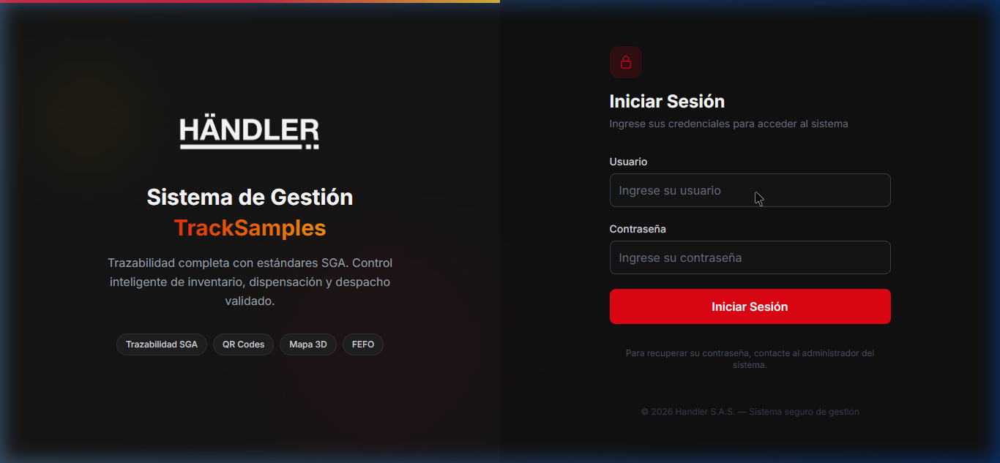
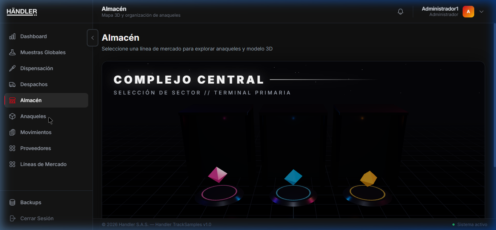
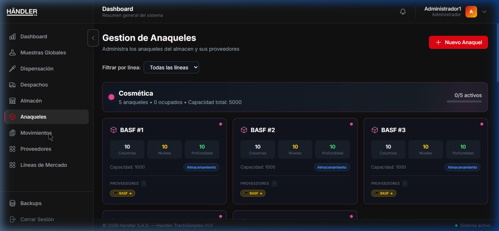
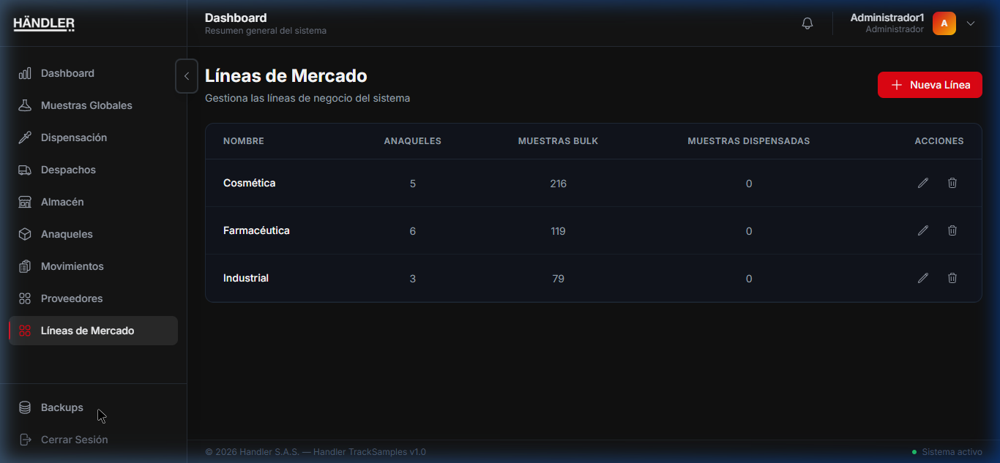
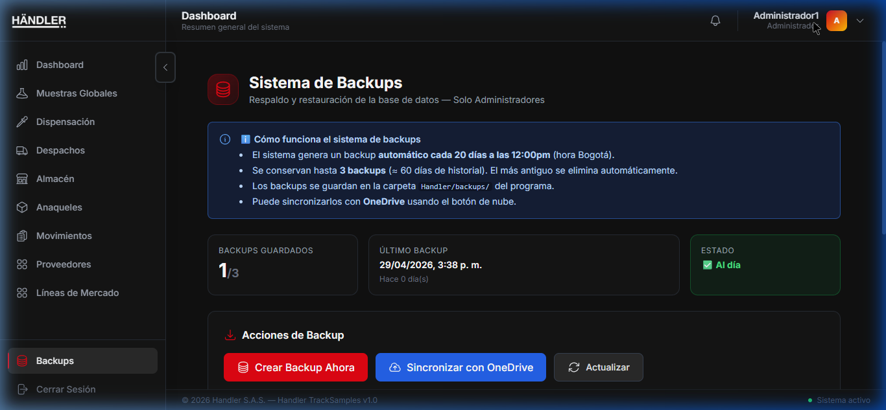
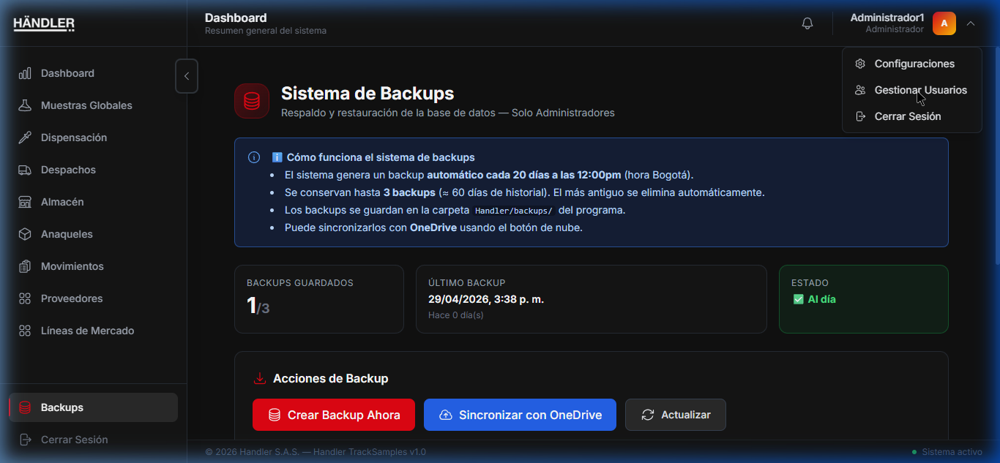

# 5. INSTRUCCIONES DE INSTALACIÓN, CONFIGURACIÓN Y OPERACIÓN

Esta sección comprende la gestión operativa y técnica del sistema, incluyendo desde el despliegue inicial hasta la explicación de las interfaces de usuario.

## 5.1. Instalación y Ejecución

El sistema Handler TrackSamples se distribuye de manera empaquetada para facilitar su despliegue local mediante un instalador de Windows (`Handler_TrackSamples_Setup.exe`).

**Paso a paso de instalación:**
1.  Verificar que Docker Desktop esté instalado y en ejecución en la máquina.
2.  Ejecutar el archivo `Handler_TrackSamples_Setup.exe` provisto.
3.  Seguir el asistente de instalación, el cual extraerá internamente los archivos del sistema y configurará los servicios locales.
4.  Durante la instalación, el sistema orquestará automáticamente el contenedor de la Base de Datos PostgreSQL a través de Docker y configurará las variables locales.
5.  Una vez instalado, iniciar la aplicación haciendo doble clic en el acceso directo "Handler TrackSamples" creado en el escritorio.

## 5.2. Interfaz de Usuario, Configuración y Recorrido

A continuación, se detalla el funcionamiento técnico y el propósito de cada pantalla principal (Módulos), acompañadas del mapeo visual. *(Nota: Las imágenes hacen referencia a capturas de la interfaz en producción).*

### Pantalla de Acceso (Login)

*   **Descripción Técnica:** Puerta de entrada. Autentica al usuario contra la API y genera el JWT almacenado en memoria.
*   **Interacciones Clave:** Campo de usuario, campo de contraseña y botón de ingreso.

### Dashboard (Panel Principal)

*   **Descripción Técnica:** Centro de telemetría del estado del inventario. Recupera indicadores de fechas de expiración.
*   **Interacciones Clave:** Paneles de Muestras Vencidas y Próximas a Vencer. Accesos rápidos.

### Inventario Maestro (Muestras Globales)

*   **Descripción Técnica:** Módulo CRUD para el registro de materia prima en bulk. Ejecuta internamente cruces con la tabla de proveedores y establece los flags de peligrosidad SGA.
*   **Interacciones Clave:** Botón 'Nueva Muestra', barra de búsqueda, sistema de filtros SGA.

### Dispensación de Muestras

*   **Descripción Técnica:** Módulo de subdivisión volumétrica y de peso. Realiza el cálculo matemático para generar lotes "hijos", asignando automáticamente códigos QR y heredando el Certificado de Análisis (CoA).
*   **Interacciones Clave:** Selector de Línea de Mercado, Panel de configuración de Frascos Hijos.

### Despachos (Flujo FEFO)

*   **Descripción Técnica:** Módulo logístico de salida. Integra el algoritmo de sugerencia First-Expired-First-Out (FEFO) mediante consultas SQL optimizadas de fechas de caducidad.
*   **Interacciones Clave:** Buscador de producto para la ejecución del algoritmo de selección recomendada.

### Visualización Espacial (Almacén 3D)

*   **Descripción Técnica:** Renderizador tridimensional usando WebGL/Three.js. Recupera el modelo Entidad-Relación de "Shelves" (Anaqueles) y dibuja el espacio de almacenamiento interactivo.
*   **Interacciones Clave:** Canvas 3D rotable/acercable, selección de sectores para detalle de capacidad.

### Gestión de Anaqueles

*   **Descripción Técnica:** Administración de la tabla `shelves`. Permite a los administradores dimensionar la capacidad matricial (filas y columnas) del almacén físico.
*   **Interacciones Clave:** Botón de creación, tarjetas informativas de ocupación volumétrica.

### Historial de Movimientos

*   **Descripción Técnica:** Log de auditoría. Consume la tabla `movements` (inmutable por políticas RLS) para trazar cada petición POST/PUT del sistema.
*   **Interacciones Clave:** Exportación de CSV, tabla cronológica con registro de IP y acción.

### Directorio de Proveedores

*   **Descripción Técnica:** Gestión de la tabla `suppliers`. Punto de enlace de las relaciones de llave foránea para las muestras globales.
*   **Interacciones Clave:** Registro de aliados, tarjetas informativas de proveedores.

### Líneas de Mercado

*   **Descripción Técnica:** Parametrización del negocio. Configura la tabla `market_lines` que sirve para categorizar sectores (ej. Cuidado Personal, Cosmética).
*   **Interacciones Clave:** Módulo de alta de líneas y vista de conteos asignados.

### Sistema de Backups

*   **Descripción Técnica:** Funcionalidad de seguridad crítica. Ejecuta una rutina interna para generar copias de la base de datos SQL local.
*   **Interacciones Clave:** Botón 'Crear Backup Ahora' para salvar los datos en la carpeta interna del sistema.

### Configuración de Cuenta y Gestión de Usuarios

*   **Descripción Técnica:** Modificación de perfiles y seguridad. La gestión de usuarios interactúa directamente con la tabla `users` generando hashes BCrypt. 
*   **Interacciones Clave:** Cambio de contraseña segura, botón para la creación de nuevos roles (Admin/Operador).

## 5.3. Copias de Seguridad (Backups)
Las copias de seguridad de la base de datos SQL se gestionan directamente desde el Panel de Backups del propio sistema. Al generar un respaldo, el sistema empaqueta la base de datos local y guarda el archivo SQL en una **carpeta interna** dedicada ubicada dentro del directorio raíz donde se instaló el software. Esto asegura que todos los datos transaccionales de Docker estén resguardados de forma íntegra a nivel local.

## 5.4. Desinstalación del Sistema
Para remover el sistema por completo del ordenador host, utilice la herramienta de desinstalación incluida:
1.  Asegúrese de haber cerrado el aplicativo Handler TrackSamples.
2.  Diríjase a "Agregar o Quitar Programas" en Windows, o ubique el archivo `uninstall.exe` en el directorio de instalación del software.
3.  Ejecute el desinstalador. Este proceso eliminará la aplicación de escritorio y detendrá/eliminará los contenedores Docker asociados a la base de datos local de forma automatizada.
