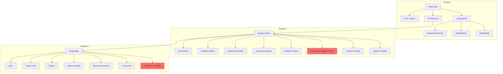

# 🔍 ANÁLISIS COMPLETO Y PLAN DE ACCIÓN - Handler TrackSamples

## 📊 ESTADO GENERAL: ~60% Completado

---

## ✅ LO QUE ESTÁ BIEN (Fortalezas)

### Arquitectura y Diseño
1. **Arquitectura modular bien estructurada** - Separación clara por dominios (auth, samples, warehouse, dispensing, dispatch, movements, analytics, suppliers)
2. **Backend con Express.js + PostgreSQL** usando `pg` con queries parametrizadas (sin inyecciones SQL)
3. **Base de datos bien diseñada** - Schema con UUIDs, timestamps, enums, constraints, índices y datos iniciales
4. **Frontend React + TailwindCSS** con componentes modulares y reutilizables
5. **Middleware de seguridad** implementado (helmet, rate limiting, cors, cookie-parser)
6. **Logging estructurado** con Winston en múltiples niveles

### Funcionalidades Implementadas
7. **Autenticación JWT** con bcrypt y cookies httpOnly
8. **CRUD de muestras globales** (bulk) con upload de CoA PDF
9. **Sistema de dispensación** con generación de códigos QR
10. **Mapa visual de almacén** con navegación jerárquica (Línea → Anaquel → Mapa 3D)
11. **CRUD de proveedores** completo
12. **Docker compose** para base de datos PostgreSQL

---

## ❌ LO QUE ESTÁ MAL (Problemas Críticos)

### 1. INCONSISTENCIA CRÍTICA: Schema BD vs Código

| Archivo | Problema | Solución |
|---------|----------|----------|
| [`backend/src/modules/dispatch/controller.js`](backend/src/modules/dispatch/controller.js:31) | Usa `child_samples` (no existe) | Cambiar a `dispensed_samples` |
| [`backend/src/modules/samples/controller.js`](backend/src/modules/samples/controller.js:13) | Usa `supplier_id` (no existe) | Cambiar a `provider` o agregar columna `supplier_id` |
| [`backend/src/modules/analytics/controller.js`](backend/src/modules/analytics/controller.js:12) | Referencia `child_samples` | Cambiar a `dispensed_samples` |
| [`backend/src/modules/warehouse/map-operations.js`](backend/src/modules/warehouse/map-operations.js:18) | Usa `shelf_depth`, `position_z` | Agregar columnas al schema o eliminar dimensión Z |

### 2. MÓDULO DE MOVIMIENTOS SIN IMPLEMENTAR
- [`backend/src/modules/movements/routes.js`](backend/src/modules/movements/routes.js:11) tiene solo un TODO
- No hay controller para movimientos

### 3. ALGORITMOS SGA INCOMPLETOS
- No existe matriz de compatibilidad química implementada
- Falta algoritmo de reubicación mínima (desfragmentación)

### 4. DESPACHOS PARCIALMENTE IMPLEMENTADOS
- [`backend/src/modules/dispatch/controller.js`](backend/src/modules/dispatch/controller.js:1) referencia tablas inexistentes
- No hay stepper de 4 pasos en frontend
- No hay validación QR física
- No hay búsqueda automática de CoA en directorio local

### 5. PROBLEMAS DE SEGURIDAD
- [`backend/.env`](backend/.env:23) tiene JWT_SECRET débil y documentado públicamente
- No hay refresh tokens
- No hay soft deletes con auditoría

---

## 🔧 LO QUE HACE FALTA

### Backend (10 items)
1. Corregir inconsistencias de schema BD vs código
2. Implementar módulo de movimientos completo
3. Algoritmo FEFO funcional con índices
4. Matriz de compatibilidad SGA completa
5. Algoritmo de desfragmentación
6. Búsqueda automática de CoA en directorio Windows
7. Sistema de impresión de etiquetas
8. Refresh tokens JWT
9. Soft deletes con auditoría
10. Health check con estado de BD

### Frontend (8 items)
11. Stepper de 4 pasos para despachos
12. Validación QR (escaneo + manual)
13. Dashboard con gráficas reales
14. Alertas de vencimiento
15. Alertas de stock bajo
16. Tema claro/oscuro
17. Página de movimientos con filtros
18. Tests E2E con Playwright

### DevOps (5 items)
19. Dockerizar aplicación backend
20. CI/CD pipeline con GitHub Actions
21. Sistema de backup automático
22. Empaquetado Electron/Tauri para Windows
23. Documentación técnica completa

---

## 📋 PLAN DE ACCIÓN - SPRINTS

### SPRINT 1: Corrección de Inconsistencias Críticas (1 semana)
**Objetivo**: Unificar schema de BD con código backend

- [ ] **Tarea 1.1**: Decidir estrategia de unificación
  - Opción A: Modificar init.sql para agregar tabla `child_samples` y columna `supplier_id`
  - Opción B: Modificar todo el código para usar `dispensed_samples` y `provider`
  - **Recomendación**: Opción B (menos cambios en BD, más consistente con SRS)

- [ ] **Tarea 1.2**: Actualizar [`backend/src/modules/dispatch/controller.js`](backend/src/modules/dispatch/controller.js:1)
  - Cambiar todas las referencias de `child_samples` a `dispensed_samples`
  - Actualizar queries para usar columnas existentes

- [ ] **Tarea 1.3**: Actualizar [`backend/src/modules/samples/controller.js`](backend/src/modules/samples/controller.js:1)
  - Cambiar `supplier_id` por `provider` o crear tabla de relación
  - Actualizar validaciones

- [ ] **Tarea 1.4**: Actualizar [`backend/src/modules/analytics/controller.js`](backend/src/modules/analytics/controller.js:1)
  - Cambiar referencias de `child_samples` a `dispensed_samples`

- [ ] **Tarea 1.5**: Actualizar [`backend/src/modules/warehouse/map-operations.js`](backend/src/modules/warehouse/map-operations.js:1)
  - Eliminar referencias a `position_z` y `shelf_depth` o agregarlas al schema

- [ ] **Tarea 1.6**: Ejecutar tests para verificar que todo funciona

### SPRINT 2: Módulo de Movimientos y Trazabilidad (1 semana)
**Objetivo**: Implementar trazabilidad completa

- [ ] **Tarea 2.1**: Crear [`backend/src/modules/movements/controller.js`](backend/src/modules/movements/controller.js:1)
  - GET /api/movements - Listar con filtros (fecha, usuario, acción, producto)
  - GET /api/movements/:id - Detalle de movimiento
  - GET /api/movements/sample/:sampleId - Historial de una muestra

- [ ] **Tarea 2.2**: Actualizar [`backend/src/modules/movements/routes.js`](backend/src/modules/movements/routes.js:1)
  - Conectar con controller
  - Agregar middleware de autenticación

- [ ] **Tarea 2.3**: Crear [`frontend/src/modules/movements/MovementsPage.jsx`](frontend/src/modules/movements/MovementsPage.jsx:1)
  - Tabla con filtros
  - Detalle de movimientos
  - Exportar a CSV

### SPRINT 3: Algoritmos SGA y FEFO (2 semanas)
**Objetivo**: Implementar algoritmos inteligentes

- [ ] **Tarea 3.1**: Crear [`backend/src/utils/sga-compatibility.js`](backend/src/utils/sga-compatibility.js:1)
  - Matriz de compatibilidad química completa
  - Función `areCompatible(class1, class2)`
  - Función `getSafeShelf(sample, shelves)`

- [ ] **Tarea 3.2**: Implementar algoritmo de organización automática
  - Función `findAutoPlacement(shelf, sample)` en [`backend/src/modules/warehouse/validations.js`](backend/src/modules/warehouse/validations.js:1)
  - Validación de vecinos por compatibilidad SGA

- [ ] **Tarea 3.3**: Implementar algoritmo de desfragmentación
  - Función `calculateMinMovements(shelf, targetSize)`
  - Retornar lista de movimientos sugeridos

- [ ] **Tarea 3.4**: Optimizar algoritmo FEFO
  - Agregar índices en `expiration_date`
  - Función `getFefoRecommendations(productName)`

### SPRINT 4: Despachos Completos (2 semanas)
**Objetivo**: Stepper de 4 pasos con validación QR

- [ ] **Tarea 4.1**: Corregir [`backend/src/modules/dispatch/controller.js`](backend/src/modules/dispatch/controller.js:1)
  - Actualizar queries para usar tablas existentes
  - Agregar búsqueda de CoA en directorio local

- [ ] **Tarea 4.2**: Crear stepper de 4 pasos en frontend
  - Paso 1: Búsqueda y FEFO
  - Paso 2: Validación QR (escaneo + manual)
  - Paso 3: Confirmación
  - Paso 4: Documentación y CoA

- [ ] **Tarea 4.3**: Implementar integración con lector QR
  - Usar `html5-qrcode` para escaneo desde cámara
  - Soporte para lectores USB (keyboard wedge)

- [ ] **Tarea 4.4**: Búsqueda automática de CoA
  - Leer directorio `C:/Handler/CoA/`
  - Buscar PDF por nombre de lote
  - Mostrar preview o permitir descarga

### SPRINT 5: Dashboard y Alertas (1 semana)
**Objetivo**: Analytics visuales y sistema de alertas

- [ ] **Tarea 5.1**: Actualizar [`backend/src/modules/analytics/controller.js`](backend/src/modules/analytics/controller.js:1)
  - Queries reales con tablas correctas
  - Estadísticas de ocupación por línea
  - Conteo de productos vencidos y por vencer

- [ ] **Tarea 5.2**: Crear dashboard con gráficas
  - Usar Recharts para gráficas circulares y de barras
  - Ocupación por línea de mercado
  - Tendencia de despachos

- [ ] **Tarea 5.3**: Sistema de alertas
  - Alertas rojas: productos vencidos
  - Alertas amarillas: productos a 30/60 días de vencer
  - Alertas de stock bajo

### SPRINT 6: Mejoras de Seguridad y UX (1 semana)
**Objetivo**: Hardening y experiencia de usuario

- [ ] **Tarea 6.1**: Generar JWT_SECRET seguro
  - Crear script para generar secret aleatorio
  - Actualizar `.env` con valor seguro

- [ ] **Tarea 6.2**: Implementar refresh tokens
  - Tabla `refresh_tokens` en BD
  - Endpoint `/api/auth/refresh`
  - Rotación de tokens

- [ ] **Tarea 6.3**: Tema claro/oscuro
  - Toggle en header
  - Persistir preferencia en localStorage
  - Actualizar componentes Tailwind

- [ ] **Tarea 6.4**: Soft deletes
  - Agregar `deleted_at` a tablas principales
  - Actualizar queries para filtrar eliminados
  - Endpoint para restaurar eliminados

### SPRINT 7: Testing y Documentación (1 semana)
**Objetivo**: Calidad y documentación

- [ ] **Tarea 7.1**: Tests E2E con Playwright
  - Test de flujo completo de dispensación
  - Test de flujo completo de despacho
  - Test de autenticación

- [ ] **Tarea 7.2**: Tests de integración
  - Tests de todas las APIs
  - Tests de algoritmos SGA

- [ ] **Tarea 7.3**: Documentación técnica
  - API documentation (OpenAPI/Swagger)
  - Guía de instalación
  - Guía de despliegue

### SPRINT 8: Empaquetado y Producción (1 semana)
**Objetivo**: Sistema listo para producción

- [ ] **Tarea 8.1**: Dockerizar backend
  - Crear Dockerfile multi-stage
  - Docker compose completo

- [ ] **Tarea 8.2**: Empaquetado Electron/Tauri
  - Configurar builder para Windows 11
  - Iconos y metadata
  - Installer NSIS

- [ ] **Tarea 8.3**: Sistema de backup
  - Script de backup automático de PostgreSQL
  - Restauración de backups

- [ ] **Tarea 8.4**: CI/CD pipeline
  - GitHub Actions para tests
  - Build automático

---

## 🎯 PRIORIDAD INMEDIATA

**Lo primero que debes hacer** es resolver la inconsistencia entre el schema de la base de datos y el código backend. Sin esto, el sistema no puede funcionar correctamente.

### Opciones:

**Opción A (Recomendada)**: Modificar el código backend para usar los nombres de tablas y columnas que ya existen en `init.sql`
- Menos riesgo de romper la BD
- Más rápido de implementar
- Requiere cambios en ~5 archivos de backend

**Opción B**: Modificar `init.sql` para agregar las tablas/columnas que el código espera
- Más cambios en BD
- Requiere migración de datos si ya hay datos
- Más alineado con el SRS original

---

## 📊 DIAGRAMA DE ARQUITECTURA ACTUAL

**Leyenda**: 
- Rojo = Incompleto/Problemático
- Verde = Funcional

---

## 💡 RECOMENDACIONES FINALES

1. **No continuar agregando features** hasta resolver las inconsistencias de schema
2. **Priorizar el Sprint 1** (corrección de inconsistencias) antes que cualquier otra cosa
3. **Crear tests de integración** después de cada sprint para evitar regresiones
4. **Documentar decisiones arquitectónicas** en un ADR (Architecture Decision Record)
5. **Considerar migrar a TypeScript** en un sprint futuro para mejor mantenibilidad
6. **Implementar CI/CD temprano** para detectar problemas de integración

---

## 📞 PRÓXIMOS PASOS

1. **Decidir estrategia de unificación** (Opción A o B para schema)
2. **Aprobar plan de sprints** o ajustar según prioridades
3. **Cambiar a modo Code** para comenzar implementación del Sprint 1
