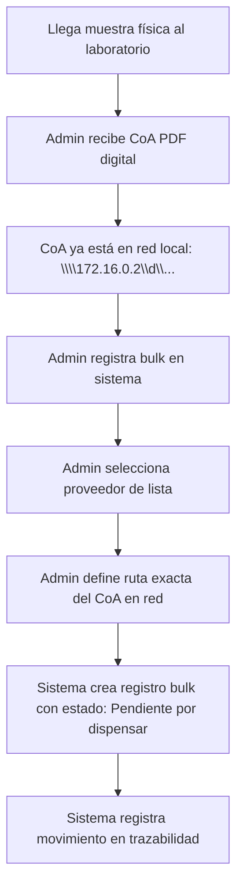
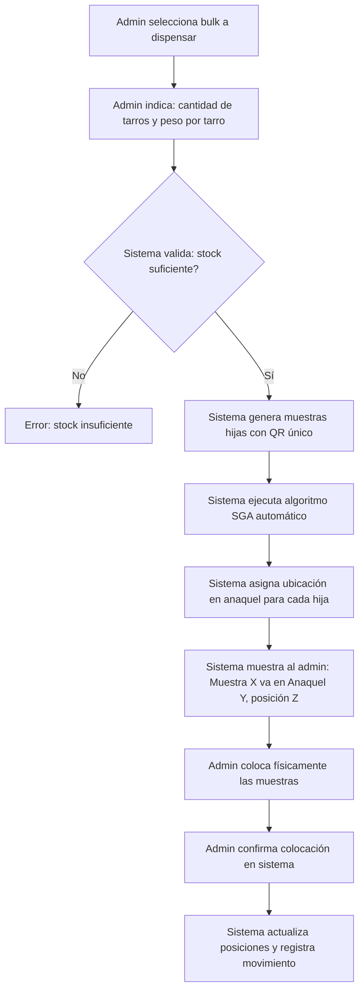
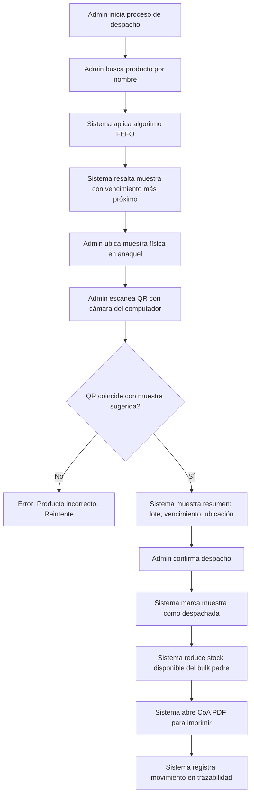
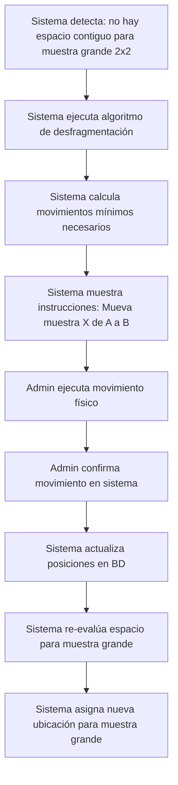
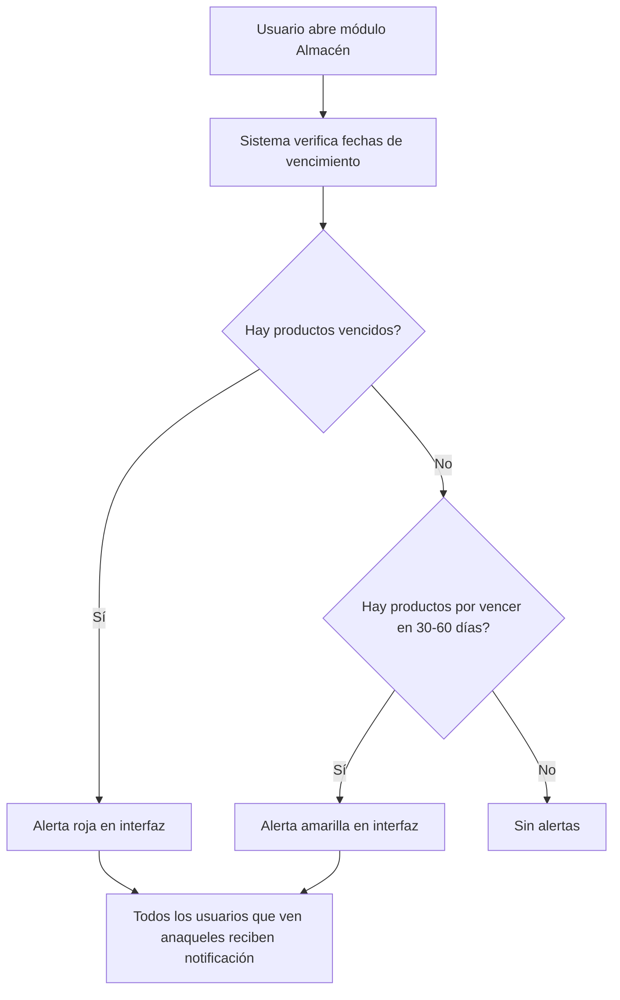

# 📋 WORKFLOWS REALES Y PLAN REFINADO - Handler TrackSamples

## 🎯 RESUMEN DE WORKFLOWS REALES

### 👥 ROLES Y RESPONSABILIDADES

| Rol | Puede hacer | No puede hacer |
|-----|-------------|----------------|
| **Admin** | TODO: registrar bulk, dispensar, despachar, crear proveedores, crear anaqueles, reubicar, ver reportes, backups | Nada restringido |
| **Operator** | Dispensar muestras, ejecutar despachos | Crear/editar proveedores, anaqueles, ver reportes |
| **Analyst** | Ver reportes, ver dashboard, ver movimientos | Modificar inventario, dispensar, despachar |

---

## 🔄 WORKFLOW 1: RECEPCIÓN DE MUESTRA GLOBAL (BULK)



**Datos clave:**
- Un solo CoA por lote
- Proveedor se selecciona de lista (relación con tabla `suppliers`)
- Ruta del CoA la define el administrador al registrar
- Solo el admin puede registrar bulk

---

## 🔄 WORKFLOW 2: DISPENSACIÓN (SUBDIVISIÓN)



**Datos clave:**
- Muestras hijas comparten CoA y fecha de vencimiento con el bulk padre
- Algoritmo SGA decide automáticamente dónde ubicar cada muestra
- El operador debe hacerle caso al sistema
- El admin coloca físicamente las muestras según las indicaciones

---

## 🔄 WORKFLOW 3: DESPACHO



**Datos clave:**
- Usa cámara del computador para escanear QR (no pistola láser)
- CoA PDF se imprime para enviar con el despacho
- Solo el admin ejecuta despachos

---

## 🔄 WORKFLOW 4: DESFRAGMENTACIÓN (REUBICACIÓN)



**Datos clave:**
- El sistema describe exactamente qué hacer
- Espera confirmación del administrador
- Una vez confirmado, muestra cambios en frontend

---

## 🔄 WORKFLOW 5: ALERTAS DE VENCIMIENTO



**Datos clave:**
- Notificaciones solo en sistema (no email)
- Todos los usuarios que pueden ver anaqueles reciben alertas

---

## 🏗️ ARQUITECTURA DE RED

```mermaid
graph TB
    subgraph Computador Admin
        A[PostgreSQL Database]
        B[Backend API :3001]
        C[Frontend Admin :3000]
    end

    subgraph Red Local
        D[\\\\172.16.0.2\\d\\Certificados]
    end

    subgraph Otros Computadores
        E[Frontend Usuario 1]
        F[Frontend Usuario 2]
        G[Frontend Usuario 3]
        H[Frontend Usuario 4]
    end

    C --> A
    C --> B
    E --> B
    F --> B
    G --> B
    H --> B
    B --> D
    B --> A
```

**Datos clave:**
- BD y Backend solo en computador del admin
- Máximo 5 usuarios en red accediendo al backend
- CoA en carpeta compartida de red local

---

## 🔧 DECISIONES ARQUITECTÓNICAS BASADAS EN WORKFLOWS

### 1. Estrategia de Unificación de Schema

**Decisión**: Modificar el código backend para usar `dispensed_samples` (tabla existente) en lugar de `child_samples` (tabla inexistente).

**Razón**: 
- `dispensed_samples` ya existe en el schema con la estructura correcta
- Las muestras hijas comparten CoA y fecha de vencimiento con el bulk padre (relación vía `global_sample_id`)
- Menos riesgo de romper la BD existente

### 2. Relación Proveedor

**Decisión**: Agregar columna `supplier_id` (UUID) a `global_samples` como relación con tabla `suppliers`.

**Razón**:
- El usuario confirmó que quiere seleccionar proveedor de lista
- La tabla `suppliers` ya existe pero no está en el schema original
- Necesitamos crear la tabla `suppliers` en el schema

### 3. Algoritmo SGA

**Decisión**: Implementar como automático (el sistema decide), con interfaz que muestra claramente dónde ubicar cada muestra.

**Razón**:
- El usuario confirmó que el operador debe hacerle caso al sistema
- No necesita confirmación previa, solo indicación clara

### 4. Escaneo QR

**Decisión**: Usar `html5-qrcode` con cámara del computador.

**Razón**:
- El usuario confirmó que usa cámara, no pistola láser
- Ya está en las dependencias del frontend

### 5. Impresión de CoA

**Decisión**: Abrir PDF en nueva ventana del navegador para imprimir desde ahí.

**Razón**:
- El CoA está en red local, el backend lo sirve como stream
- El frontend lo abre en iframe o nueva ventana para imprimir

---

## 📋 PLAN DE ACCIÓN REFINADO

### SPRINT 1: Corrección de Inconsistencias (1 semana)

**Objetivo**: Unificar schema BD con código backend sin romper funcionalidades existentes

#### Tarea 1.1: Crear tabla `suppliers` en schema
```sql
CREATE TABLE suppliers (
    id UUID PRIMARY KEY DEFAULT uuid_generate_v4(),
    name VARCHAR(255) UNIQUE NOT NULL,
    market_lines TEXT[], -- Array de líneas de mercado
    phone VARCHAR(50),
    email VARCHAR(255),
    address TEXT,
    created_at TIMESTAMP WITH TIME ZONE DEFAULT CURRENT_TIMESTAMP,
    updated_at TIMESTAMP WITH TIME ZONE DEFAULT CURRENT_TIMESTAMP
);
```

#### Tarea 1.2: Agregar columna `supplier_id` a `global_samples`
```sql
ALTER TABLE global_samples 
ADD COLUMN supplier_id UUID REFERENCES suppliers(id);

-- Migrar datos existentes: mapear provider texto a supplier_id
UPDATE global_samples gs 
SET supplier_id = s.id 
FROM suppliers s 
WHERE gs.provider = s.name;
```

#### Tarea 1.3: Actualizar `backend/src/modules/dispatch/controller.js`
- Cambiar todas las referencias de `child_samples` a `dispensed_samples`
- Actualizar queries para usar columnas existentes

#### Tarea 1.4: Actualizar `backend/src/modules/analytics/controller.js`
- Cambiar referencias de `child_samples` a `dispensed_samples`

#### Tarea 1.5: Actualizar `backend/src/modules/samples/controller.js`
- Usar `supplier_id` en lugar de `provider` texto
- Actualizar validaciones y queries

#### Tarea 1.6: Ejecutar tests para verificar que todo funciona

---

### SPRINT 2: Algoritmo SGA Automático (1 semana)

**Objetivo**: Implementar algoritmo que decide automáticamente dónde ubicar cada muestra dispensada

#### Tarea 2.1: Crear `backend/src/utils/sga-compatibility.js`
- Matriz de compatibilidad química
- Función `areCompatible(class1, class2)`
- Función `getSafeShelf(sample, shelves)`

#### Tarea 2.2: Implementar `findAutoPlacement` en `backend/src/modules/warehouse/validations.js`
- Escanea anaquel disponible
- Valida compatibilidad con vecinos
- Retorna coordenadas (x, y) seguras

#### Tarea 2.3: Actualizar flujo de dispensación
- Al dispensar, el sistema asigna ubicación automáticamente
- Retorna instrucciones claras para el admin

---

### SPRINT 3: Algoritmo de Desfragmentación (1 semana)

**Objetivo**: Implementar algoritmo que calcula movimientos mínimos para crear espacio

#### Tarea 3.1: Crear `backend/src/utils/defragmentation.js`
- Algoritmo BFS para encontrar espacio contiguo
- Calcula movimientos mínimos necesarios
- Retorna lista de instrucciones

#### Tarea 3.2: Implementar endpoint de desfragmentación
- POST /api/warehouse/:id/defragment
- Retorna instrucciones paso a paso

#### Tarea 3.3: Implementar UI de desfragmentación en frontend
- Muestra instrucciones paso a paso
- Botón de confirmación por cada movimiento
- Actualiza vista después de confirmar

---

### SPRINT 4: Despacho con Cámara QR (2 semanas)

**Objetivo**: Stepper de despacho con escaneo QR por cámara

#### Tarea 4.1: Corregir `backend/src/modules/dispatch/controller.js`
- Actualizar queries para usar `dispensed_samples`
- Agregar endpoint para servir CoA PDF desde red local

#### Tarea 4.2: Implementar stepper de 4 pasos en frontend
- Paso 1: Búsqueda + FEFO
- Paso 2: Escaneo QR con cámara (html5-qrcode)
- Paso 3: Confirmación
- Paso 4: Vista de CoA PDF para imprimir

#### Tarea 4.3: Implementar integración con cámara
- Componente QRScanner con html5-qrcode
- Validación automática al escanear
- Manejo de errores de cámara

---

### SPRINT 5: Alertas y Notificaciones (1 semana)

**Objetivo**: Sistema de alertas de vencimiento en interfaz

#### Tarea 5.1: Implementar verificación de vencimiento en backend
- GET /api/samples/expiring?days=30
- GET /api/samples/expired

#### Tarea 5.2: Implementar alertas en frontend
- Banner rojo para productos vencidos
- Banner amarillo para productos por vencer (30/60 días)
- Notificaciones en módulo Almacén

---

### SPRINT 6: Configuración de Red y Multi-usuario (1 semana)

**Objetivo**: Configurar acceso en red local para hasta 5 usuarios

#### Tarea 6.1: Configurar backend para aceptar conexiones de red
- Escuchar en 0.0.0.0 en lugar de localhost
- Configurar CORS para IPs de red local

#### Tarea 6.2: Configurar variable de entorno para ruta de CoA
- Permitir configurar ruta de red en .env
- Soporte para rutas UNC (\\\\server\\share)

#### Tarea 6.3: Documentar configuración de red
- Guía para configurar acceso en red local
- Instrucciones para firewall de Windows

---

## ⚠️ RIESGOS IDENTIFICADOS

| Riesgo | Impacto | Mitigación |
|--------|---------|------------|
| Migración de datos de `provider` a `supplier_id` | Medio | Script de migración con validación |
| Algoritmo SGA coloca muestras incorrectamente | Alto | Testing exhaustivo con casos reales |
| Cámara no funciona en algunos computadores | Medio | Fallback a input manual de QR |
| Ruta de red no accesible desde backend | Alto | Validar acceso al iniciar sistema |
| Múltiples usuarios editando al mismo tiempo | Medio | Transacciones atómicas en BD |

---

## 📊 MÉTRICAS DE ÉXITO

- [ ] Todas las APIs responden en < 500ms
- [ ] Algoritmo SGA coloca muestras sin conflictos de compatibilidad
- [ ] Escaneo QR funciona en < 2 segundos
- [ ] Alertas de vencimiento se muestran correctamente
- [ ] Sistema funciona con hasta 5 usuarios simultáneos
- [ ] CoA PDF se abre e imprime correctamente desde red local
